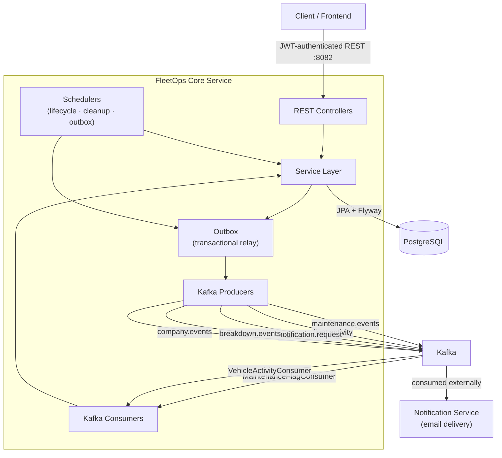

# FleetOps Core Service — Architecture

## Overview

FleetOps Core Service is a Spring Boot 3 REST API that manages the full lifecycle of a vehicle fleet. It handles companies, users, vehicles, trip requests, mileage tracking, maintenance workflows, and breakdown incidents. Domain events are published to Kafka for async processing and downstream notification delivery. Reliable event publishing is guaranteed by a transactional outbox pattern.

---

## Architecture Diagram



---

## Use Case Diagram

```mermaid
flowchart LR
    PA(("Platform\nAdmin"))
    CA(("Company\nAdmin"))
    FM(("Fleet\nManager"))
    FS(("Field\nStaff"))
    MC(("Maintenance\nCrew"))

    subgraph SYS["FleetOps Core Service"]

        subgraph AUTH["Authentication"]
            login(["Login"])
            chpwd(["Change Password"])
        end

        subgraph COMP["Company Management"]
            reg_co(["Register Company"])
            appr_co(["Approve Company"])
            rej_co(["Reject Company"])
            susp_co(["Suspend Company"])
            react_co(["Reactivate Company"])
            view_prof(["View / Update Company Profile"])
        end

        subgraph UMGMT["User Management"]
            cre_usr(["Create User"])
            act_usr(["Activate / Deactivate User"])
            rst_pwd(["Reset Password"])
            upd_img(["Update Profile Picture"])
            view_crew(["View Available Crew"])
        end

        subgraph VEH["Vehicle Management"]
            reg_veh(["Register Vehicle"])
            view_veh(["View Vehicles"])
            view_avail(["View Available Vehicles"])
            upd_ms(["Update Milestone Interval"])
            veh_imgs(["Manage Vehicle Images"])
            view_health(["View Health & Lifecycle"])
            dl_pdf(["Download Lifecycle PDF"])
        end

        subgraph TRIP["Trip Requests"]
            cre_trip(["Create Trip Request"])
            view_trips(["View Trip Requests"])
            appr_trip(["Approve Trip"])
            rej_trip(["Reject Trip"])
            comp_trip(["Complete Trip"])
            conf_comp(["Confirm Completion"])
            cancel_trip(["Cancel Trip"])
            appr_cancel(["Approve Cancellation"])
        end

        subgraph MIL["Mileage Tracking"]
            log_mil(["Submit Mileage Log"])
            view_mil(["View Mileage Logs"])
        end

        subgraph MAINT["Maintenance"]
            cre_flag(["Create Maintenance Flag"])
            asgn_crew(["Assign Crew to Flag"])
            sub_quot(["Submit Quotation"])
            rev_quot(["Revise Quotation"])
            appr_quot(["Approve Quotation"])
            rej_quot(["Reject Quotation"])
            upd_prog(["Update Work Progress"])
            mark_done(["Mark Work Done"])
            res_maint(["Resolve & Rate Crew"])
            flag_msg(["Send / View Flag Messages"])
        end

        subgraph BRKD["Breakdown"]
            rpt_brkd(["Report Breakdown"])
            disp_repl(["Dispatch Replacement Vehicle"])
            disp_crew(["Dispatch Maintenance Crew"])
            res_brkd(["Resolve Breakdown"])
        end

        subgraph RPT["Reports & Dashboard"]
            plat_dash(["Platform Dashboard"])
            util_rpt(["Utilisation Report"])
            hlth_rpt(["Vehicle Health Report"])
            act_log(["View Activity Logs"])
        end

    end

    PA --> login & chpwd
    PA --> appr_co & rej_co & susp_co & react_co
    PA --> cre_usr & view_crew
    PA --> disp_crew
    PA --> plat_dash

    CA --> login & chpwd
    CA --> reg_co & view_prof
    CA --> cre_usr & act_usr & rst_pwd & upd_img
    CA --> util_rpt & hlth_rpt

    FM --> login & chpwd
    FM --> reg_veh & view_veh & view_avail & upd_ms & veh_imgs & view_health & dl_pdf
    FM --> view_trips & appr_trip & rej_trip & conf_comp & appr_cancel
    FM --> view_mil
    FM --> cre_flag & asgn_crew & appr_quot & rej_quot & res_maint & flag_msg
    FM --> disp_repl & res_brkd
    FM --> util_rpt & hlth_rpt & act_log & view_crew

    FS --> login & chpwd
    FS --> cre_trip & view_trips & comp_trip & cancel_trip
    FS --> log_mil & view_mil
    FS --> rpt_brkd
    FS --> upd_img

    MC --> login & chpwd
    MC --> sub_quot & rev_quot & upd_prog & mark_done & flag_msg
    MC --> upd_img
```



---

## Domain Modules

| Package | Responsibility |
|---|---|
| `auth` | JWT login, password change, Spring Security stateless filter chain |
| `company` | Company registration, approval lifecycle (`PENDING → APPROVED → REJECTED / SUSPENDED`); one `COMPANY_ADMIN` per company enforced by DB partial unique index |
| `user` | User CRUD, activation/deactivation, role-based access; one-admin-per-company guard at repository level |
| `vehicle` | Vehicle registration, status management, service history, lifecycle scoring, health grading, PDF report generation, vehicle image gallery |
| `triprequest` | Trip request lifecycle: `PENDING → APPROVED → COMPLETED / REJECTED / CANCELLED`; intermediate states `PENDING_COMPLETION`, `PENDING_CANCELLATION`, `BROKEN_DOWN`; `VehicleAssignment` records live here |
| `mileage` | Odometer readings, milestone crossing detection, maintenance trigger via Kafka |
| `maintenance` | Flag lifecycle: `OPEN → CREW_ASSIGNED → QUOTE_SUBMITTED → QUOTE_APPROVED / QUOTE_REJECTED → IN_PROGRESS → PENDING_APPROVAL → RESOLVED`; in-flag messaging between crew and manager; crew performance ratings |
| `breakdown` | Breakdown reporting, crew dispatch (platform admin), replacement vehicle dispatch (creates `TripRequest` for the assigned field staff), resolution tracking |
| `activity` | Immutable vehicle event log consumed from Kafka, exposed via dashboard API |
| `lga` | Nigerian LGA reference data — 774 state/area codes loaded from CSV at startup, used for plate number validation |
| `media` | Cloudinary media record management for user profile images and vehicle photo galleries |
| `outbox` | Transactional outbox: `OutboxEvent` rows are written in the same DB transaction as the triggering domain change; a scheduler publishes them to Kafka with up to 3 retries, then marks each `PUBLISHED` or `FAILED` |
| `admin` | Fleet utilisation reports, vehicle health summaries, platform-wide dashboard |
| `kafka` | Producers (`MaintenanceEventProducer`, `NotificationEventProducer`, `VehicleActivityProducer`) and consumers (`MaintenanceFlagConsumer` on `maintenance.events`, `VehicleActivityConsumer` on `fleet.activity`); topics: `maintenance.events`, `fleet.activity`, `notification.request`, `breakdown.events`, `company.events` |
| `shared/config` | Security, Swagger/OpenAPI, Kafka, data seeding (`DataSeeder` for admin account, `LgaCodeSeeder` for plate reference data) |
| `shared/exception` | `GlobalExceptionHandler` — maps all domain exceptions to structured HTTP error responses |
| `shared/validation` | Custom Bean Validation constraints: `@ValidPlateNumber`, `@ValidPassword` |
| `shared/context` | `TenantContext` (ThreadLocal multi-tenancy), `TenantFilter`, `TenantAspect` |

---

## Entity Relationship Diagram

```mermaid
erDiagram
    companies {
        bigint id PK
        varchar name UK
        varchar email UK
        varchar contact_phone
        varchar address
        varchar logo_url
        varchar status "PENDING|APPROVED|REJECTED|SUSPENDED"
        varchar rejection_reason
        timestamp registered_at
        timestamp approved_at
    }

    users {
        bigint id PK
        bigint company_id FK
        varchar name
        varchar email UK
        varchar password_hash
        varchar role "PLATFORM_ADMIN|COMPANY_ADMIN|FLEET_MANAGER|FIELD_STAFF|MAINTENANCE_CREW"
        varchar user_type "PLATFORM|COMPANY"
        boolean active
        boolean available
        double average_rating
        int total_jobs_completed
        text profile_image_url
        timestamp created_at
    }

    vehicles {
        bigint id PK
        bigint company_id FK
        varchar make
        varchar model
        varchar plate_number UK
        double current_mileage
        double milestone_interval
        decimal purchase_price
        date purchase_date
        decimal total_maintenance_spend
        int breakdown_count
        double health_score
        varchar health_grade
        double lifecycle_percentage
        boolean marked_for_sale
        double max_mileage
        int max_trips
        int max_maintenance_rounds
        varchar status "AVAILABLE|ASSIGNED|MAINTENANCE|BROKEN_DOWN|OUT_OF_SERVICE|RECOVERY"
        timestamp registered_at
    }

    vehicle_images {
        bigint id PK
        bigint vehicle_id FK
        text image_url
        varchar image_id
    }

    service_histories {
        bigint id PK
        bigint vehicle_id FK
        varchar fleet_manager_name
        text notes
        double new_milestone_interval
        decimal actual_cost
        timestamp serviced_at
    }

    trip_requests {
        bigint id PK
        bigint company_id FK
        bigint vehicle_id FK
        bigint requested_by_id FK
        varchar destination
        date start_date
        date end_date
        varchar status "PENDING|APPROVED|REJECTED|COMPLETED|CANCELLED|BROKEN_DOWN|PENDING_COMPLETION|PENDING_CANCELLATION"
        varchar rejection_reason
        timestamp created_at
        timestamp approved_at
        timestamp completed_at
    }

    vehicle_assignments {
        bigint id PK
        bigint company_id FK
        bigint trip_request_id FK
        bigint vehicle_id FK
        bigint assigned_to_id FK
        timestamp assigned_at
    }

    mileage_logs {
        bigint id PK
        bigint company_id FK
        bigint vehicle_id FK
        bigint submitted_by_id FK
        bigint trip_request_id FK
        double reported_mileage
        timestamp logged_at
    }

    maintenance_flags {
        bigint id PK
        bigint company_id FK
        bigint vehicle_id FK
        bigint assigned_crew_id FK
        bigint requested_by_user_id FK
        varchar trigger_type
        varchar status "OPEN|CREW_ASSIGNED|QUOTE_SUBMITTED|QUOTE_APPROVED|QUOTE_REJECTED|IN_PROGRESS|PENDING_APPROVAL|RESOLVED"
        text description
        text progress_notes
        timestamp opened_at
        timestamp assigned_at
        timestamp resolved_at
    }

    maintenance_quotations {
        bigint id PK
        bigint flag_id FK
        bigint crew_id FK
        bigint company_id FK
        decimal estimated_cost
        text description
        text parts_needed
        decimal actual_cost
        varchar status "PENDING|APPROVED|REJECTED"
        varchar rejection_reason
        int revision_number
        timestamp submitted_at
        timestamp reviewed_at
    }

    maintenance_flag_messages {
        bigint id PK
        bigint flag_id FK
        bigint sender_id FK
        varchar sender_name
        varchar sender_role
        text message
        timestamp sent_at
    }

    maintenance_ratings {
        bigint id PK
        bigint flag_id FK
        bigint crew_id FK
        bigint company_id FK
        bigint rated_by_user_id FK
        int stars
        text comment
        timestamp rated_at
    }

    breakdown_reports {
        bigint id PK
        bigint company_id FK
        bigint vehicle_id FK
        bigint trip_request_id FK
        bigint field_staff_id FK
        double latitude
        double longitude
        text location_description
        text description
        varchar status "REPORTED|REPLACEMENT_DISPATCHED|CREW_DISPATCHED|RESOLVED"
        bigint assigned_crew_id FK
        bigint replacement_vehicle_id FK
        bigint replacement_trip_request_id FK
        bigint maintenance_flag_id FK
        timestamp reported_at
        timestamp resolved_at
    }

    vehicle_activity_logs {
        bigint id PK
        bigint company_id FK
        bigint vehicle_id "denormalised"
        varchar plate_number "denormalised"
        varchar event_type
        text description
        varchar actor_name
        varchar actor_role
        timestamp occurred_at
    }

    media {
        bigint id PK
        varchar public_id UK
        text url
        varchar owner_type "USER or VEHICLE"
        bigint owner_id "polymorphic ref"
    }

    outbox_events {
        bigint id PK
        varchar topic
        varchar event_type
        text payload
        varchar status "PENDING|PUBLISHED|FAILED"
        int retry_count
        timestamp created_at
        timestamp published_at
    }

    lga_codes {
        varchar code PK
        varchar lga
        varchar state
    }

    companies ||--o{ users : "has"
    companies ||--o{ vehicles : "owns"
    companies ||--o{ trip_requests : "has"
    companies ||--o{ vehicle_assignments : "has"
    companies ||--o{ mileage_logs : "has"
    companies ||--o{ maintenance_flags : "has"
    companies ||--o{ maintenance_quotations : "has"
    companies ||--o{ maintenance_ratings : "has"
    companies ||--o{ breakdown_reports : "has"
    companies ||--o{ vehicle_activity_logs : "has"

    vehicles ||--o{ vehicle_images : "gallery"
    vehicles ||--o{ service_histories : "history"
    vehicles ||--o{ trip_requests : "assigned_to"
    vehicles ||--o{ vehicle_assignments : "in"
    vehicles ||--o{ mileage_logs : "tracked_by"
    vehicles ||--o{ maintenance_flags : "flagged"
    vehicles ||--o{ breakdown_reports : "broken_down_in"
    vehicles |o--o{ breakdown_reports : "replacement_for"

    users ||--o{ trip_requests : "requests"
    users ||--o{ vehicle_assignments : "assigned"
    users ||--o{ mileage_logs : "submits"
    users |o--o{ maintenance_flags : "crew"
    users |o--o{ maintenance_flags : "opener"
    users ||--o{ maintenance_quotations : "submits"
    users ||--o{ maintenance_flag_messages : "sends"
    users ||--o{ maintenance_ratings : "rated_as_crew"
    users ||--o{ maintenance_ratings : "rates"
    users ||--o{ breakdown_reports : "field_staff"
    users |o--o{ breakdown_reports : "dispatched_crew"

    trip_requests ||--|| vehicle_assignments : "has"
    trip_requests |o--o{ mileage_logs : "has"
    trip_requests |o--o{ breakdown_reports : "original_trip"
    trip_requests |o--o{ breakdown_reports : "replacement_trip"

    maintenance_flags ||--o{ maintenance_quotations : "has"
    maintenance_flags ||--o{ maintenance_flag_messages : "has"
    maintenance_flags ||--o{ maintenance_ratings : "has"
    maintenance_flags |o--o{ breakdown_reports : "linked"
```



> **Notes**
> - `vehicle_activity_logs.vehicle_id` and `plate_number` are **denormalised** — stored as plain values at event time rather than FK references, so the audit trail remains intact if the vehicle record is later removed or its plate number changes.
> - `media.owner_id` is a **polymorphic reference** resolved by `owner_type` (`USER` or `VEHICLE`) — no database-level FK constraint.
> - `outbox_events` and `lga_codes` have **no FK relationships**; they are infrastructure and reference tables respectively.
> - `breakdown_reports` FK columns `trip_request_id`, `assigned_crew_id`, `replacement_vehicle_id`, `replacement_trip_request_id`, and `maintenance_flag_id` are all **nullable** (set progressively as the breakdown lifecycle advances).
> - `maintenance_flags` FK columns `assigned_crew_id` and `requested_by_user_id` are **nullable**.

---

## Class Diagram

```mermaid
classDiagram
    direction TB

    class Company {
        +Long id
        +String name
        +String email
        +CompanyStatus status
        +LocalDateTime registeredAt
    }

    class User {
        +Long id
        +String name
        +String email
        +Role role
        +UserType userType
        +boolean active
        +Double averageRating
    }

    class Vehicle {
        +Long id
        +String make
        +String model
        +String plateNumber
        +Double currentMileage
        +Double milestoneInterval
        +VehicleStatus status
        +Double healthScore
        +String healthGrade
        +Double lifecyclePercentage
        +boolean markedForSale
    }

    class VehicleImage {
        +Long id
        +String imageUrl
        +String imageId
    }

    class ServiceHistory {
        +Long id
        +String notes
        +BigDecimal actualCost
        +LocalDateTime servicedAt
    }

    class TripRequest {
        +Long id
        +String destination
        +LocalDate startDate
        +LocalDate endDate
        +TripRequestStatus status
        +LocalDateTime createdAt
    }

    class VehicleAssignment {
        +Long id
        +LocalDateTime assignedAt
    }

    class MileageLog {
        +Long id
        +Double reportedMileage
        +LocalDateTime loggedAt
    }

    class MaintenanceFlag {
        +Long id
        +TriggerType triggerType
        +FlagStatus status
        +String description
        +LocalDateTime openedAt
        +LocalDateTime resolvedAt
    }

    class MaintenanceQuotation {
        +Long id
        +BigDecimal estimatedCost
        +BigDecimal actualCost
        +QuotationStatus status
        +Integer revisionNumber
    }

    class MaintenanceMessage {
        +Long id
        +String senderName
        +String senderRole
        +String message
        +LocalDateTime sentAt
    }

    class MaintenanceRating {
        +Long id
        +Integer stars
        +String comment
        +LocalDateTime ratedAt
    }

    class BreakdownReport {
        +Long id
        +Double latitude
        +Double longitude
        +String description
        +BreakdownStatus status
        +LocalDateTime reportedAt
        +LocalDateTime resolvedAt
    }

    class VehicleActivityLog {
        +Long id
        +String eventType
        +String description
        +String actorName
        +LocalDateTime occurredAt
    }

    class OutboxEvent {
        +Long id
        +String topic
        +String eventType
        +String payload
        +OutboxStatus status
        +Integer retryCount
        +LocalDateTime createdAt
    }

    class Media {
        +Long id
        +String publicId
        +String url
        +String ownerType
        +Long ownerId
    }

    class LgaCode {
        +String code
        +String lga
        +String state
    }

    class Role {
        <<enumeration>>
        PLATFORM_ADMIN
        COMPANY_ADMIN
        FLEET_MANAGER
        FIELD_STAFF
        MAINTENANCE_CREW
    }

    class UserType {
        <<enumeration>>
        PLATFORM
        COMPANY
    }

    class CompanyStatus {
        <<enumeration>>
        PENDING
        APPROVED
        REJECTED
        SUSPENDED
    }

    class VehicleStatus {
        <<enumeration>>
        AVAILABLE
        ASSIGNED
        MAINTENANCE
        BROKEN_DOWN
        OUT_OF_SERVICE
        RECOVERY
    }

    class TripRequestStatus {
        <<enumeration>>
        PENDING
        APPROVED
        REJECTED
        COMPLETED
        CANCELLED
        BROKEN_DOWN
        PENDING_COMPLETION
        PENDING_CANCELLATION
    }

    class BreakdownStatus {
        <<enumeration>>
        REPORTED
        REPLACEMENT_DISPATCHED
        CREW_DISPATCHED
        RESOLVED
    }

    class FlagStatus {
        <<enumeration>>
        OPEN
        CREW_ASSIGNED
        QUOTE_SUBMITTED
        QUOTE_APPROVED
        QUOTE_REJECTED
        IN_PROGRESS
        PENDING_APPROVAL
        RESOLVED
    }

    class TriggerType {
        <<enumeration>>
        MILEAGE
        MANUAL
        BREAKDOWN
    }

    class QuotationStatus {
        <<enumeration>>
        PENDING
        APPROVED
        REJECTED
    }

    class OutboxStatus {
        <<enumeration>>
        PENDING
        PUBLISHED
        FAILED
    }

    %% Company aggregates all tenant-scoped entities
    Company "1" --> "0..*" User : employs
    Company "1" --> "0..*" Vehicle : owns
    Company "1" --> "0..*" TripRequest : initiates
    Company "1" --> "0..*" MaintenanceFlag : tracks
    Company "1" --> "0..*" BreakdownReport : records
    Company "1" --> "0..*" MileageLog : logs
    Company "1" --> "0..*" VehicleActivityLog : audits
    Company --> CompanyStatus

    %% User
    User --> Role
    User --> UserType

    %% Vehicle and its children
    Vehicle "1" *-- "0..*" VehicleImage : gallery
    Vehicle "1" *-- "0..*" ServiceHistory : history
    Vehicle --> VehicleStatus

    %% TripRequest
    TripRequest "0..*" --> "1" Vehicle : uses
    TripRequest "0..*" --> "1" User : requestedBy
    TripRequest "1" *-- "1" VehicleAssignment : linked
    TripRequest --> TripRequestStatus
    VehicleAssignment "0..*" --> "1" Vehicle : assignedVehicle
    VehicleAssignment "0..*" --> "1" User : assignedTo

    %% MileageLog
    MileageLog "0..*" --> "1" Vehicle : tracks
    MileageLog "0..*" --> "1" User : submittedBy
    MileageLog "0..*" --> "0..1" TripRequest : relatesTo

    %% MaintenanceFlag and its children
    MaintenanceFlag "0..*" --> "1" Vehicle : for
    MaintenanceFlag "0..*" --> "0..1" User : assignedCrew
    MaintenanceFlag --> TriggerType
    MaintenanceFlag --> FlagStatus
    MaintenanceFlag "1" *-- "0..*" MaintenanceQuotation : quotations
    MaintenanceFlag "1" *-- "0..*" MaintenanceMessage : messages
    MaintenanceFlag "1" *-- "0..*" MaintenanceRating : ratings
    MaintenanceQuotation "0..*" --> "1" User : submittedByCrew
    MaintenanceQuotation --> QuotationStatus
    MaintenanceMessage "0..*" --> "1" User : sentBy
    MaintenanceRating "0..*" --> "1" User : crew
    MaintenanceRating "0..*" --> "1" User : ratedBy

    %% BreakdownReport
    BreakdownReport "0..*" --> "1" Vehicle : brokenVehicle
    BreakdownReport "0..*" --> "0..1" Vehicle : replacementVehicle
    BreakdownReport "0..*" --> "1" User : fieldStaff
    BreakdownReport "0..*" --> "0..1" User : assignedCrew
    BreakdownReport "0..*" --> "0..1" TripRequest : originalTrip
    BreakdownReport "0..*" --> "0..1" TripRequest : replacementTrip
    BreakdownReport "0..*" --> "0..1" MaintenanceFlag : triggers
    BreakdownReport --> BreakdownStatus

    %% OutboxEvent
    OutboxEvent --> OutboxStatus
```



---

## Key Data Flows

### Mileage Submission → Maintenance Flag (Kafka-driven)

```
FIELD_STAFF  →  POST /api/mileage-logs
    └─ MileageLogService updates vehicle.currentMileage
    └─ if currentMileage >= milestoneInterval:
         └─ MaintenanceEventProducer publishes MaintenanceFlagCreatedEvent
              topic: maintenance.events
              └─ MaintenanceFlagConsumer (async):
                   ├─ Sets vehicle.status = MAINTENANCE
                   ├─ Creates MaintenanceFlag (status = OPEN)
                   ├─ Publishes VehicleActivityEvent (MAINTENANCE_SCHEDULED)
                   │    topic: fleet.activity
                   │    └─ VehicleActivityConsumer persists to vehicle_activity_logs
                   └─ Publishes NotificationRequestEvent
                        topic: notification.request
                        └─ External Notification Service sends email to fleet managers
```

### Company Registration & Lifecycle Notifications

All company lifecycle notifications are sent to the **`COMPANY_ADMIN` user's email** — not the company's business email address. The admin user is looked up via `userRepository.findByCompanyIdAndRole(companyId, COMPANY_ADMIN)` and notification is sent only if that user exists (silent skip otherwise).

```
PUBLIC            →  POST /api/public/companies/register
    └─ CompanyServiceImpl.register():
         ├─ Creates Company (status = PENDING)
         ├─ Creates COMPANY_ADMIN User
         └─ Sends "COMPANY_REGISTERED" notification → adminEmail

PLATFORM_ADMIN    →  PATCH /api/platform/companies/{id}/approve
    └─ CompanyServiceImpl.approveCompany():
         ├─ Sets company.status = APPROVED
         └─ Sends "COMPANY_APPROVED" notification → COMPANY_ADMIN user email

PLATFORM_ADMIN    →  PATCH /api/platform/companies/{id}/reject
    └─ CompanyServiceImpl.rejectCompany():
         ├─ Sets company.status = REJECTED
         └─ Sends "COMPANY_REJECTED" notification → COMPANY_ADMIN user email

PLATFORM_ADMIN    →  PATCH /api/platform/companies/{id}/suspend
    └─ CompanyServiceImpl.suspendCompany():
         ├─ Sets company.status = SUSPENDED
         └─ Sends "COMPANY_SUSPENDED" notification → COMPANY_ADMIN user email

PLATFORM_ADMIN    →  PATCH /api/platform/companies/{id}/reactivate
    └─ CompanyServiceImpl.reactivateCompany():
         ├─ Sets company.status = APPROVED
         └─ Sends "COMPANY_REACTIVATED" notification → COMPANY_ADMIN user email
```

### Trip Request Lifecycle

```
FIELD_STAFF    →  POST  /api/trip-requests                (status: PENDING)
FLEET_MANAGER  →  PATCH /api/trip-requests/{id}/approve
    ├─ Creates VehicleAssignment record
    ├─ Sets vehicle.status = ASSIGNED
    ├─ Auto-rejects conflicting PENDING requests for the same vehicle
    └─ Publishes notification → field staff notified of approval

FIELD_STAFF    →  PATCH /api/trip-requests/{id}/complete   (→ PENDING_COMPLETION)
FLEET_MANAGER  →  PATCH /api/trip-requests/{id}/confirm-completion  (→ COMPLETED)
    └─ Sets vehicle.status = AVAILABLE

FIELD_STAFF    →  PATCH /api/trip-requests/{id}/cancel     (→ PENDING_CANCELLATION)
FLEET_MANAGER  →  PATCH /api/trip-requests/{id}/approve-cancellation  (→ CANCELLED)

Breakdown path:
    └─ Trip status may transition to BROKEN_DOWN when a breakdown is reported
       against the vehicle assigned to the trip
```

### Breakdown → Replacement Vehicle Dispatch

```
FIELD_STAFF    →  POST /api/breakdowns
    └─ Sets vehicle.status = BROKEN_DOWN
    └─ Notifies fleet managers + platform admins

FLEET_MANAGER  →  PATCH /api/breakdowns/{id}/dispatch-replacement
    ├─ Validates replacement vehicle is AVAILABLE
    ├─ Validates staffId: must be FIELD_STAFF in same company, active
    ├─ Sets replacement.status = ASSIGNED
    ├─ Creates TripRequest (status = APPROVED) for the assigned staff member
    ├─ Links replacement vehicle + trip to the breakdown report
    ├─ Sets breakdown.status = REPLACEMENT_DISPATCHED
    └─ Sends two notifications: one to original field staff, one to assigned driver

PLATFORM_ADMIN →  PATCH /api/platform/breakdowns/{id}/dispatch-crew
    ├─ Assigns MAINTENANCE_CREW to the breakdown
    ├─ Creates linked MaintenanceFlag for repair work
    └─ Notifies the assigned crew member

FLEET_MANAGER  →  PATCH /api/breakdowns/{id}/resolve
    └─ Sets vehicle.status = AVAILABLE, breakdown.status = RESOLVED
```

### Vehicle Health & Lifecycle Scoring (hourly scheduler)

```
VehicleLifecycleService (@Scheduled every hour)
    └─ For each vehicle, two separate computations run:

    ── Health Score (0–100) ───────────────────────────────────────────
         wearIndex = (mileageWear   × 25)   mileage consumed vs max
                   + (maintFreq    × 20)   resolved flags vs max rounds
                   + (costRatio    × 15)   maintenance spend vs purchase price
                   + (tripIntensity× 15)   qualified trips vs max trips
                   + (breakdownRate× 15)   breakdown count (capped at 5)
                   + (ageRatio     × 10)   vehicle age vs 15-year ceiling
         healthScore = 100 − wearIndex
         healthGrade = EXCELLENT (≥86) | GOOD (≥71) | FAIR (≥51) | POOR (≥31) | CRITICAL (<31)

    ── Lifecycle Percentage ───────────────────────────────────────────
         lifecyclePercentage = (mileageFactor × 0.50)
                             + (tripFactor    × 0.25)
                             + (maintFactor   × 0.25)
                             capped at 100%

    ── Retirement ─────────────────────────────────────────────────────
         if lifecyclePercentage >= 80%:
             vehicle.status       = OUT_OF_SERVICE
             vehicle.markedForSale = true
```

### Transactional Outbox (reliable event publishing)

```
Service.someOperation() [within @Transactional]
    ├─ Writes domain changes to DB
    └─ Writes OutboxEvent row (topic, payload, status=PENDING) to DB
         └─ Both writes commit atomically — no event is lost if Kafka is down

OutboxPublisher (@Scheduled fixedDelay=10s)
    └─ Queries PENDING events where retryCount < 3
         ├─ Publishes each to Kafka via KafkaTemplate
         ├─ On success: marks PUBLISHED
         └─ On failure: increments retryCount; after 3 failures marks FAILED
```

---

## User Roles & Permissions

| Role | User Type | Key Capabilities |
|---|---|---|
| `PLATFORM_ADMIN` | PLATFORM | Approve/reject/suspend companies; dispatch maintenance crew to breakdowns; view all data |
| `COMPANY_ADMIN` | COMPANY | One per company (enforced by DB); company profile management |
| `FLEET_MANAGER` | COMPANY | Approve trips, manage vehicles, assign maintenance crew, dispatch replacement vehicles, resolve breakdowns |
| `FIELD_STAFF` | COMPANY | Report breakdowns, create trip requests, submit mileage logs |
| `MAINTENANCE_CREW` | PLATFORM | Submit quotations, update maintenance progress |

**One-admin-per-company constraint**: enforced at two levels — a partial unique index on `users(company_id, role) WHERE role = 'COMPANY_ADMIN'` prevents duplicate records at the database level, and `UserRepository.existsByCompanyIdAndRole()` is checked in the service layer before creation to return a clear error message.

---

## Design Decisions

**Kafka for notifications, not synchronous calls**
The notification pathway is fully decoupled from the API request. A slow or unavailable notification service never blocks fleet operations. The notification service can evolve independently — swap email providers, add SMS — without touching this service.

**Transactional outbox for reliable event publishing**
Kafka publish is not part of the DB transaction. Without an outbox, a crash between the DB commit and the Kafka send loses the event permanently. `OutboxEvent` rows are committed atomically with the domain change; the scheduler replays them until they are acknowledged by the broker.

**Notification routing to COMPANY_ADMIN user, not business email**
Company lifecycle events (registered, approved, rejected, suspended, reactivated) are sent to the `COMPANY_ADMIN` user's personal email, looked up via `findByCompanyIdAndRole`. This ensures the right person receives the notification regardless of what the company's registered business email is.

**Stateless JWT authentication**
No server-side session state. Any number of service instances can run behind a load balancer without sticky sessions or shared session storage. JWT expiry and signing secret are injected at runtime via environment variables.

**Flyway for schema management**
Schema evolution is version-controlled, reproducible, and auditable. `ddl-auto: validate` ensures the application refuses to start if the runtime schema diverges from the entity model, preventing silent drift between environments.

**Denormalised `vehicle_id` / `plate_number` in activity logs**
Activity logs are an immutable audit trail. If a vehicle is later removed or its plate changes, the historical log must still reflect what happened at the time. Denormalisation here is intentional by design.

**Nigerian plate number validation**
The 774 LGA codes are seeded from `nigeria_plate_codes.csv` at startup. Validation is enforced via a custom `@ValidPlateNumber` Bean Validation constraint checked at the API boundary, not at the database level, so the error message can be descriptive.

**Replacement dispatch creates a real TripRequest**
When a fleet manager dispatches a replacement vehicle, a `TripRequest` (status = `APPROVED`) is created and linked to the breakdown report. This keeps the replacement vehicle's assigned status in the regular trip lifecycle and gives the platform a complete audit trail of who drove what vehicle and when.

---

## Scalability Considerations

| Concern | Current approach | Notes for growth |
|---|---|---|
| **Horizontal scaling** | Stateless JWT, no shared session | Run N instances behind any load balancer |
| **Notification throughput** | Kafka decouples email load from request path | Notification service scales independently |
| **Outbox reliability** | Scheduler with retry on each instance | Add ShedLock to prevent duplicate publishes when running multiple instances |
| **Scheduled jobs** | Spring `@Scheduled` — runs on all instances | Add ShedLock or move to a dedicated scheduler node when running multiple instances |
| **Read-heavy endpoints** | Direct DB query on every request | Add Redis (`@Cacheable`) on `GET /api/vehicles/available` and admin reports as fleet size grows |
| **Schema evolution** | Flyway versioned migrations (V1–V22) | Zero-downtime schema changes can be planned and rolled out per migration |

---

## Environment Variables

| Variable | Dev default | Description |
|---|---|---|
| `DB_URL` | `jdbc:postgresql://localhost:5432/fleetops_core` | PostgreSQL JDBC URL |
| `DB_USERNAME` | `postgres` | Database username |
| `DB_PASSWORD` | *(required in production — no default)* | Database password |
| `KAFKA_BOOTSTRAP` | `localhost:9092` | Kafka broker address |
| `JWT_SECRET` | *(required in production — no default)* | HMAC-SHA256 signing key (min 32 bytes) |
| `JWT_EXPIRY_MS` | `86400000` (24 h) | Token lifetime in milliseconds |
| `ADMIN_NAME` | `System Admin` | Display name of the seeded platform admin account |
| `ADMIN_EMAIL` | `admin@fleetops.com` | Email of the seeded platform admin account |
| `ADMIN_PASSWORD` | *(required in production — no default)* | Password of the seeded platform admin account |
| `DEFAULT_MILESTONE_INTERVAL` | `3000` | Default vehicle maintenance threshold (km) |
| `CORS_ALLOWED_ORIGINS` | `http://localhost:5173` | Allowed CORS origin — update `SecurityConfig.corsConfigurationSource()` to inject this before deploying a production frontend |
