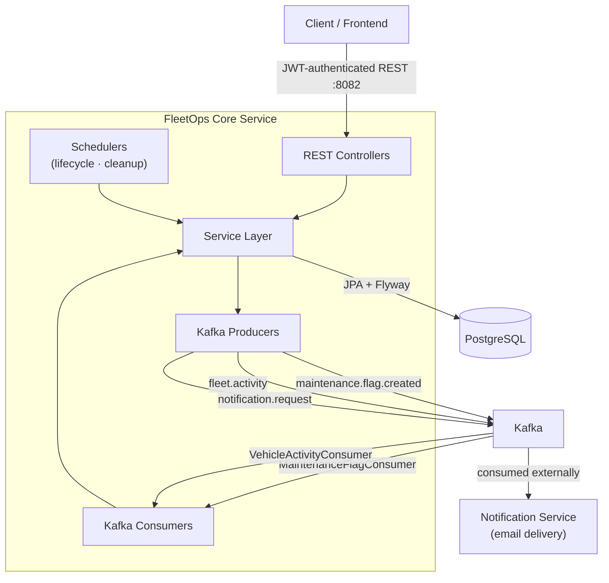

# FleetOps Core Service — Architecture

## Overview

FleetOps Core Service is a Spring Boot 3 REST API that manages the full lifecycle of a vehicle fleet. It handles users, vehicles, trip requests, mileage tracking, and maintenance workflows. Domain events are published to Kafka for async processing and downstream notification delivery.

---

## Architecture Diagram



---

## Domain Modules

| Package | Responsibility |
|---|---|
| `auth` | JWT login, password change, Spring Security stateless filter chain |
| `user` | User CRUD, activation/deactivation, role-based access |
| `vehicle` | Vehicle registration, status management, service history, lifecycle scoring |
| `triprequest` | Trip request lifecycle: `PENDING → APPROVED → COMPLETED / REJECTED` |
| `mileage` | Odometer readings, milestone crossing detection, maintenance trigger |
| `maintenance` | Flag lifecycle: `OPEN → ASSIGNED → IN_PROGRESS → PENDING_APPROVAL → RESOLVED` |
| `assignment` | Vehicle assignment records created when a trip is approved |
| `activity` | Immutable vehicle event log consumed from Kafka, exposed via dashboard API |
| `media` | Cloudinary media record management for vehicles and user profiles |
| `admin` | Fleet utilisation reports and vehicle health summaries |
| `kafka` | Producers (`MaintenanceEventProducer`, `NotificationEventProducer`, `VehicleActivityProducer`) and consumers (`MaintenanceFlagConsumer`, `VehicleActivityConsumer`) |
| `config` | Security, Swagger/OpenAPI, Kafka, data seeding |
| `exception` | `GlobalExceptionHandler` — maps all domain exceptions to structured HTTP error responses |
| `validation` | Custom Bean Validation constraints: `@ValidPlateNumber`, `@ValidPassword` |

---

## Key Data Flows

### Mileage Submission → Maintenance Flag (Kafka-driven)

```
FIELD_STAFF  →  POST /api/mileage-logs
    └─ MileageLogService updates vehicle.currentMileage
    └─ if currentMileage >= milestoneInterval:
         └─ MaintenanceEventProducer publishes MaintenanceFlagCreatedEvent
              topic: maintenance.flag.created
              └─ MaintenanceFlagConsumer (async):
                   ├─ Sets vehicle.status = MAINTENANCE
                   ├─ Creates MaintenanceFlag (status = OPEN)
                   ├─ Publishes VehicleActivityEvent (MAINTENANCE_SCHEDULED)
                   │    topic: fleet.activity
                   │    └─ VehicleActivityConsumer persists to vehicle_activity_logs
                   └─ Publishes NotificationRequestEvent
                        topic: notification.request
                        └─ External Notification Service sends email to fleet managers
```

### Trip Request Lifecycle

```
FIELD_STAFF    →  POST  /api/trip-requests                (status: PENDING)
FLEET_MANAGER  →  PATCH /api/trip-requests/{id}/approve
    ├─ Creates VehicleAssignment record
    ├─ Sets vehicle.status = ASSIGNED
    ├─ Auto-rejects conflicting PENDING requests for the same vehicle
    └─ Publishes notification → field staff notified of approval

FIELD_STAFF    →  PATCH /api/trip-requests/{id}/complete
    └─ Sets vehicle.status = AVAILABLE
    └─ Optional: inline mileage submission triggers milestone check
```

### Vehicle Lifecycle Scoring (hourly scheduler)

```
VehicleLifecycleService (@Scheduled every hour)
    └─ For each vehicle:
         lifecyclePercentage = (mileageFactor × 0.50)
                             + (tripFactor     × 0.25)
                             + (maintFactor    × 0.25)
         if lifecyclePercentage >= 80%:
             vehicle.status      = OUT_OF_SERVICE
             vehicle.markedForSale = true
```

---

## Design Decisions

**Kafka for notifications, not synchronous calls**
The notification pathway is fully decoupled from the API request. A slow or unavailable notification service never blocks fleet operations. The notification service can evolve independently — swap email providers, add SMS — without touching this service.

**Stateless JWT authentication**
No server-side session state. Any number of service instances can run behind a load balancer without sticky sessions or shared session storage. JWT expiry and signing secret are injected at runtime via environment variables.

**Flyway for schema management**
Schema evolution is version-controlled, reproducible, and auditable. `ddl-auto: validate` ensures the application refuses to start if the runtime schema diverges from the entity model, preventing silent drift between environments.

**Denormalised `vehicle_id` / `plate_number` in activity logs**
Activity logs are an immutable audit trail. If a vehicle is later removed or its plate changes, the historical log must still reflect what happened at the time. Denormalisation here is intentional by design.

**Nigerian plate number validation**
The 774 LGA codes are seeded from `nigeria_plate_codes.csv` at startup. Validation is enforced via a custom `@ValidPlateNumber` Bean Validation constraint checked at the API boundary, not at the database level, so the error message can be descriptive.

---

## Scalability Considerations

| Concern | Current approach | Notes for growth |
|---|---|---|
| **Horizontal scaling** | Stateless JWT, no shared session | Run N instances behind any load balancer |
| **Notification throughput** | Kafka decouples email load from request path | Notification service scales independently |
| **Scheduled jobs** | Spring `@Scheduled` — runs on all instances | Add ShedLock or move to a dedicated scheduler node when running multiple instances |
| **Read-heavy endpoints** | Direct DB query on every request | Add Redis (`@Cacheable`) on `GET /api/vehicles/available` and admin reports as fleet size grows |
| **Schema evolution** | Flyway versioned migrations | Zero-downtime schema changes can be planned and rolled out per migration |

---

## Environment Variables

| Variable | Dev default | Description |
|---|---|---|
| `DB_URL` | `jdbc:postgresql://localhost:5432/fleetops_core` | PostgreSQL JDBC URL |
| `DB_USERNAME` | `postgres` | Database username |
| `DB_PASSWORD` | *(required in production — no default)* | Database password |
| `KAFKA_BOOTSTRAP` | `localhost:9092` | Kafka broker address |
| `JWT_SECRET` | *(required in production — no default)* | HMAC-SHA256 signing key (min 32 bytes) |
| `JWT_EXPIRY_MS` | `86400000` (24 h) | Token lifetime in milliseconds |
| `ADMIN_NAME` | `System Admin` | Display name of the seeded admin account |
| `ADMIN_EMAIL` | `admin@fleetops.com` | Email of the seeded admin account |
| `ADMIN_PASSWORD` | *(required in production — no default)* | Password of the seeded admin account |
| `DEFAULT_MILESTONE_INTERVAL` | `3000` | Default vehicle maintenance threshold (km) |
| `CORS_ALLOWED_ORIGINS` | `http://localhost:5173` | Comma-separated allowed CORS origins |
